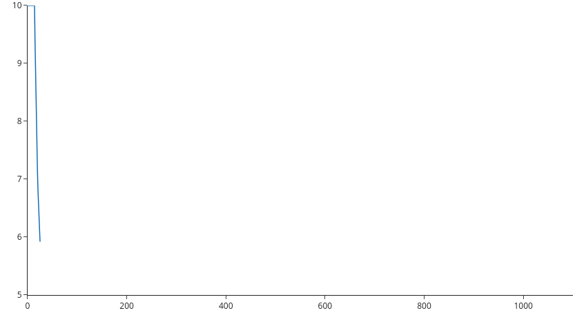

# Exploring Pokémon Legends: Arceus reviews

**Pokémon Legends: Arceus** was released on January 28th, 2022 with a big promise: to change the pokémon formula. The games have been around since 1996 and together are the [highest-grossing video game franchise](https://www.titlemax.com/discovery-center/lifestyle/the-top-50-highest-grossing-video-game-franchises/) today. Ever since that first contact with the amazing Pokémon Red/Blue, fans have mostly seen the same game concept in all mainline games: some young trainer taking on a villain team as she/he journeys to become the pokémon league champion. The battling and catching mechanics have changed very little and newer games have made an effort to make training easier and faster (*back in the day you could only exp. share with one pokémon at a time!*).

So, when Legends: Arceus was [announced](https://www.youtube.com/watch?v=v2zj0y6GFq8&ab_channel=NintendoWire) the pokémon world was full of expectations. A new game with an open-world concept, dynamic catching mechanics and actual battling going on (as opposed to the [Pokémon Let's Go games](https://pokemonletsgo.pokemon.com/en-us/)). However, the fans [were not happy about the visuals](https://gamerant.com/pokemon-legends-arceus-graphics-controversy-explained/) of the game. A lot has been said about this game's graphics and how it just doesn't compare with modern open-world games.

Now, over two months after release, we are going to explore Pokémon Legends: Arceus reviews from [metacritic](https://www.metacritic.com/game/switch/pokemon-legends-arceus/user-reviews?sort-by=score&num_items=100) and try to analyze a little of what users are saying about the game. The reviews were scraped using our [scraper](scraper.py) on March 19, 2022.

## Evolution of user score

To get an peak into the analysis, here's an evolution of user score over time as seen by the Cummulative Moving Average of scores. Scores are sorted by date and the average is calculated for each new entry.

*Example usage of dash app1.*

## Files to check out:

* [Scraping.ipynb](Scraping.ipynb): this is the notebook where all the testing is done to build the scraper. Note that it is unorganized!

* [scraper.py](scraper.py): this is the actual scraper to use. NOTE: you can easily change the `url` in `main()` to reuse this scraper for any other game in metacritic (subject to testing).

* [EDA.ipynb](EDA.ipynb): this is where all the analysis is done. I use pandas, spacy and plotly to explore user reviews. To get a feel into user sentiment, I use VADER to compare the predicted sentiment with the given score. Two bonuses at the end of the file: getting all of our data processing into a single pandas pipe and a cool looking word cloud for our dataset.

Hope you enjoy the content!
Any feedback is greatly appreciated!